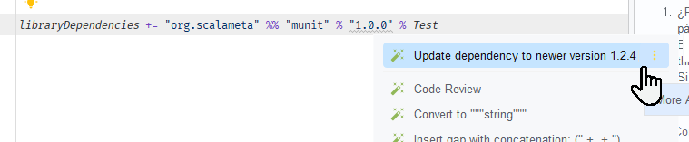

## GitHub Classroom Quickstart

## Uso de este repositorio

Este repositorio no es el template final del semestre.

Su objetivo es servir como **base para crear el template** que se usara en la tarea o proyecto de este semestre. En otras palabras, es un **template de templates**.

>[!IMPORTANT]
> Antes de publicar el template final del semestre, borra este archivo y el contenido de `DELETE_ME/`.

---

## Flujo recomendado

### 1. Crea un repositorio nuevo a partir de esta base

No uses `fork` dentro de la misma organizacion.

Usa esta ruta:

1. Desde `https://github.com/dcc-cc3002/template-proyecto`
2. Haz clic en `Use this template`
3. Elige `Create new repository`

Ejemplo:

```text
final-reality-2026
```

Ese repositorio nuevo sera el que luego adaptarás como template oficial de la entrega.

---

### 2. Adapta el repositorio al semestre y a la tarea

En el repositorio nuevo:

* renombra el repositorio si hace falta
* actualiza el `README.md` (borra instrucciones internas y referenciar el programa en que se basará el proyecto)
  * ejemplo: `Simplified clone of Final Fantasy by Square Enix`
* actualiza dependencias y versiones
  * Versiones de Scala: https://www.scala-lang.org/download/all.html
  * MUnit debiera IntelliJ sugerir la versión más nueva (ver imagen abajo)
* deja solo las instrucciones que deban ver estudiantes

El template deberia quedar listo para usar **Scala 3 + MUnit**. El estudiantado **no debiera** necesitar hacer cambios en `build.sbt` durante el semestre.



---

### 3. Borra archivos temporales antes de publicar

Antes de marcar el repositorio como template:

* borra `DELETE_ME/GH-CLASSROOM-QUICKSTART.md`
* borra cualquier otro archivo temporal dentro de `DELETE_ME/`
* verifica que no queden instrucciones internas para el equipo docente

El repositorio publicado como template debe contener solo el material que recibirá el estudiantado.

---

### 4. Marca el repositorio nuevo como template repository

En el repositorio creado a partir del template:

1. Ve a `Settings`
2. Marca `Template repository`

---

### 5. Corre los smoke tests antes de importarlo en Classroom

Antes de importar este repositorio desde GitHub Classroom, verifica que la configuración base siga sana:

```bash
sbt test
```

Estos smoke tests son solo para docentes configurando el repositorio. Sirven para detectar problemas en `build.sbt`, `project/` o la estructura base antes de publicarlo para estudiantes.

Si `sbt test` falla, corrige la configuración antes de seguir.

---

### 6. Crea el Classroom y el assignment

Configura GitHub Classroom con estos pasos:

1. Desde `https://classroom.github.com/classrooms`, haz clic en `New classroom`
2. En `Select an Organization`, elige `dcc-cc3002`
3. En `Name your Classroom`, usa un nombre como:

```text
cc3002-2026-1
```

Luego haz clic en `Create classroom`.

4. En `Add Collaborators`, elige `Skip this for now`
5. En `Add Students to Roster`, elige `Skip` y luego `Continue`

Esto se hará después con el link que se comparte al estudiantado.

6. En `Assignments`, haz clic en `Create an assignment`
7. Completa la configuración así:

`Assignment title`

Ejemplo:

```text
Final Reality 2026
```

`Deadline`

No rellenar.

`Individual or group assignment`

Elegir `Individual`.

`Starter code`

Configurar así:

* `Add a repository to give students starter code`: buscar el repo base
* `Repository visibility`: `private`
* `Grant students admin access to their repository`: sí
* `Copy the default branch only`: sí
* `Supported editor`: dejar sin marcar

8. En `Set up autograding and feedback`, hacer clic en `Create assignment` sin cambiar nada

---

## Resultado esperado

Al finalizar este flujo:

* existe un template semestral limpio y listo para estudiantes
* el repositorio creado desde `template-proyecto` queda marcado como template repository
* GitHub Classroom usa ese template para crear los repositorios
* cada estudiante o equipo recibe su repositorio oficial del proyecto
